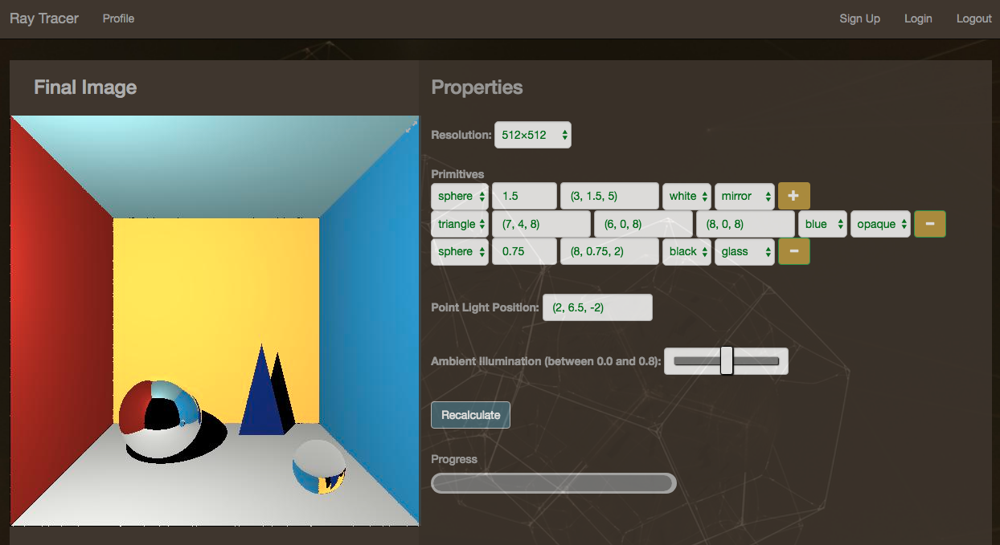

# raytracer app(3D graphics)
A raytracer app where the user can create a 3D image of geometric shapes by providing
vertices, position, color and even material of the objects in the scene.

## Quick Setup
1. Clone this repository.   
2. Install the requirements:`$ pip install -r requirements.txt`.  
3. Open a second terminal window and start a local RabbitMQ server: `$ rabbitmq-server`.  
4. Open a third terminal window and starta Celery worker: `$ celery worker -A app.celery --loglevel=info`.
5. Start the Flask application on your original terminal window:`$ python app.py`.  
6. Finally, go to `http://localhost:5000/`.

